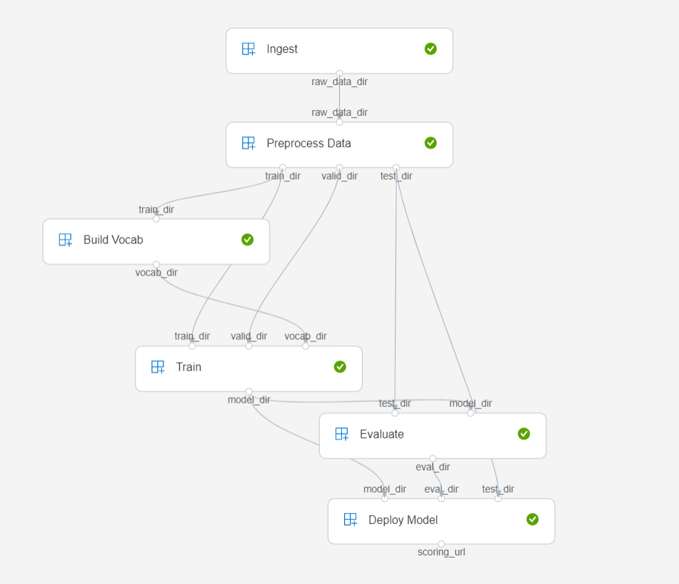

# Generate paper titles

We train a model that generates titles for mathematical papers based on their abstracts. This proof-of-concept repo will demonstrate AzureML workflow for a typical data science project. Concretely we set up pipelines to:

- Ingest: Grab raw data from the arXiv.
- Process: Prepare the text for the model, split into train/valid/test sets.
- Build vocab: Construct a vocabulary from the training data.
- Train: Train a simple NMT attention model built in PyTorch.
- Evaluate: Evaluate the model on the test data.
- Deploy: Deploy the model to a webservice.

Disclaimers:
- The NMT model we use here is strictly for demonstration purposes and was forked from here: https://github.com/pcyin/pytorch_basic_nmt. In their words:

> This is a basic implementation of attentional neural machine translation (Bahdanau et al., 2015, Luong et al., 2015) in Pytorch 0.4.
It implements the model described in [Luong et al., 2015](https://arxiv.org/abs/1508.04025), and supports label smoothing, beam-search decoding and random sampling.
With 256-dimensional LSTM hidden size, it achieves 28.13 BLEU score on the IWSLT 2014 Germen-English dataset (Ranzato et al., 2015).

- The structure for this pipeline was taken from this example: https://github.com/Azure/aml-object-classification-pipeline

TODO: retitle this repo with a title generated by the model and with the above as the input :-)

## Pipeline Structure

This code builds the following pipeline in AzureML.

The results from individual steps are cached, and only recomputed if there are changes with that step (or anywhere upstream!).

### License

This work is licensed under a Creative Commons Attribution 4.0 International License.